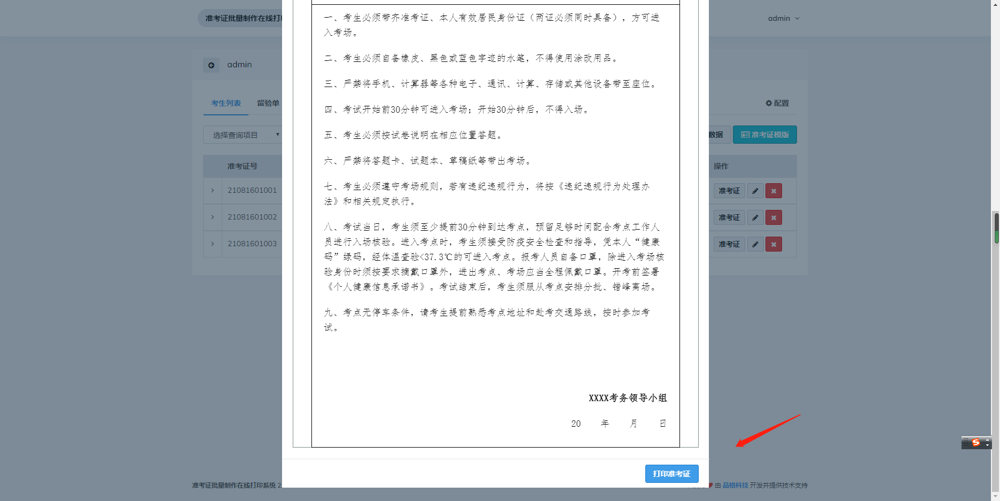
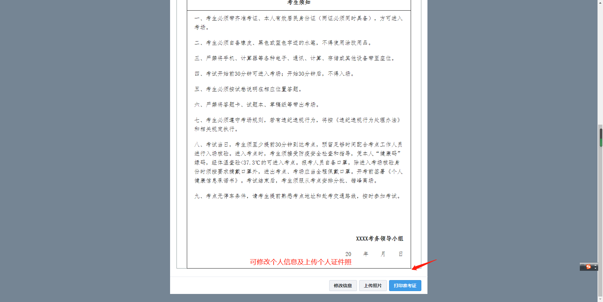

# 快速使用

## **导入考生信息**

点击【浏览本地】，将考生信息数据导入系统。

导入后可以预览考生相关信息

------

## **制作准考证模版**

表格常用配置(边框、颜色、内边距、字体等)

**表格边框**

**单元格设置**

后续步骤可参照表格设置

**字体格式以及其他设置**

------

## **预览准考证**

------

## **修改准考证**

------

## **修改考生个人信息**

------

## **上传考生照片**

------

## **打印准考证**

------

## **导出考生数据**

------

## **考生在线打印相关配置**

------

## **考生登陆页面**（一般设置准考证号登陆，也可设置手机号）

考生仅能修改系统设置考生可以修改的信息
如上一步骤：系统设置考生可修改手机号及上传个人照片

------

## **留验单、桌贴、门贴制作**

**留验单制作与打印**

**桌贴，门贴制作与打印**

**修改记录**（可查看考生修改的信息）
