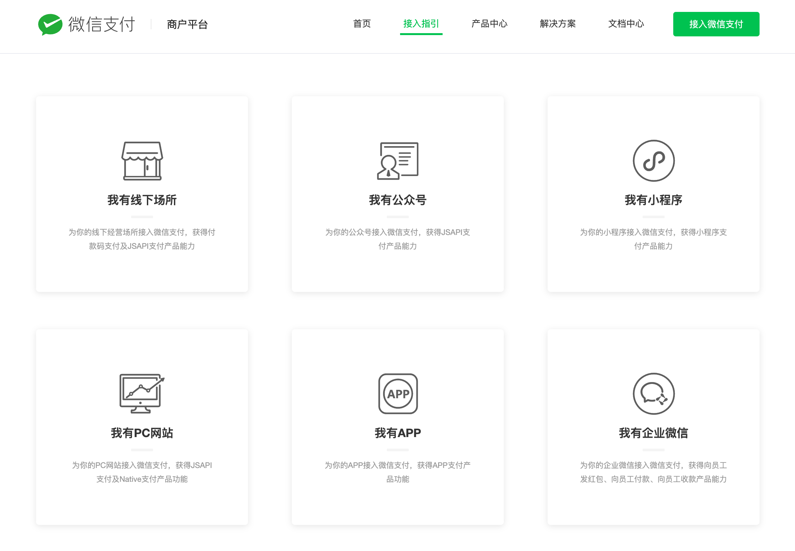
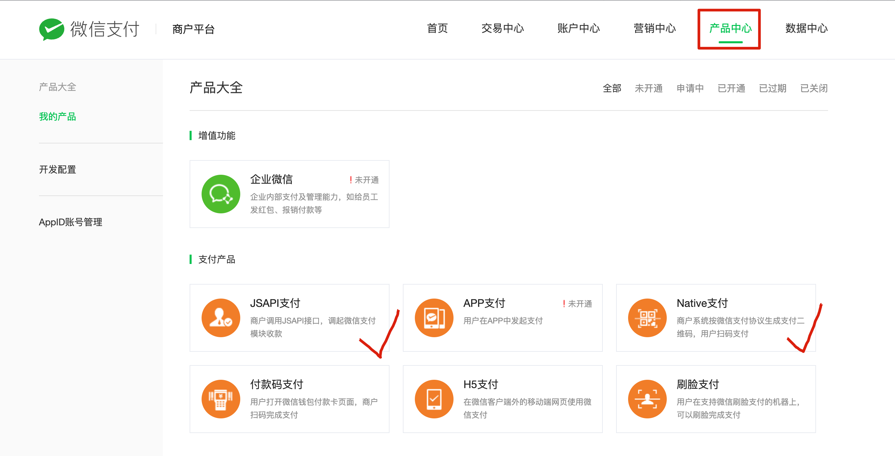
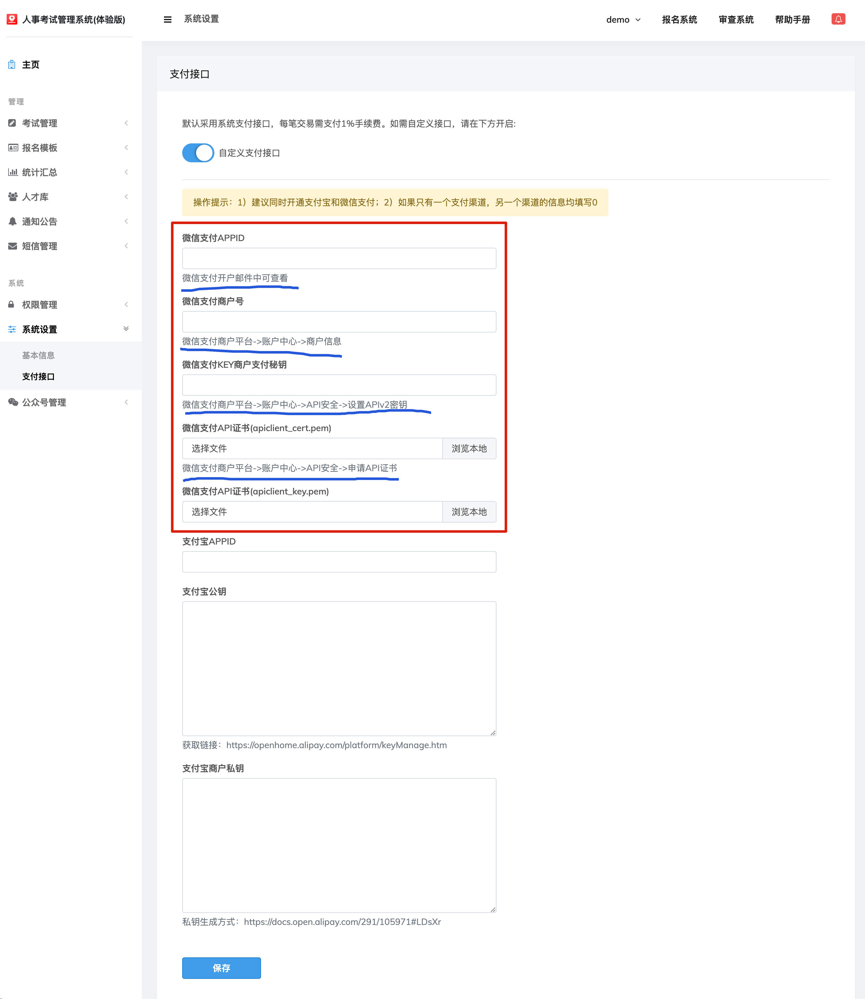

# 如何开通微信支付接口？

## 1、登录微信支付商户平台

[微信支付接入指引 - 微信支付商户平台 (qq.com)](https://pay.weixin.qq.com/static/applyment_guide/applyment_index.shtml)

机构费率表：https://kf.qq.com/faq/220228IJb2UV220228uEjU3Q.html

## 2、选择一种接入方式

首选【我有公众号】方式，如果您已有认证过的微信服务号，可以选择此项，进行快速办理。

次选【我有企业微信】方式，不管当前您是否已开通企业微信，都可以选择此项，办理速度仅次于首选方式。

## 3、开通微信支付商户版之后，请进入【产品中心】，依次开通下图中打勾的支付产品

## 4、进入报名管理系统管理后台

进入【系统设置->支付接口】页面，开启【自定义支付接口】

按表单顺序依次填写相应信息。

信息获取方式，可参考表单下方的说明文字。

填写完毕，点击保存。

微信支付商户版及支付接口，设置完毕。

## 常见问题处理

[请访问：腾讯客服-微信支付商户专区 (qq.com)](https://kf.qq.com/product/wechatpaymentmerchant.html)