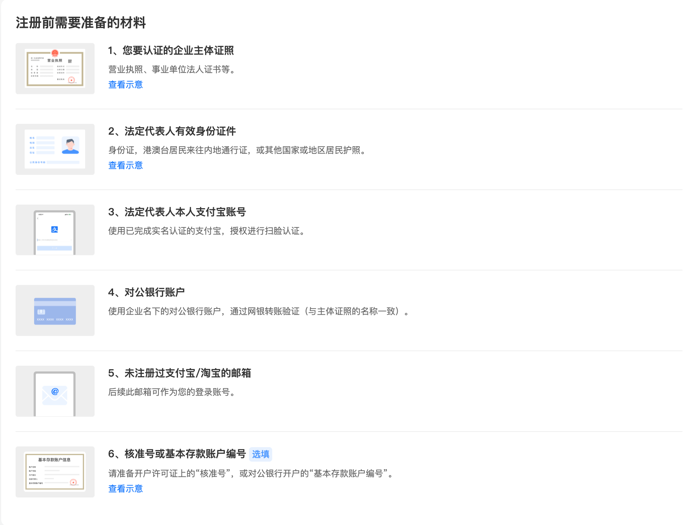
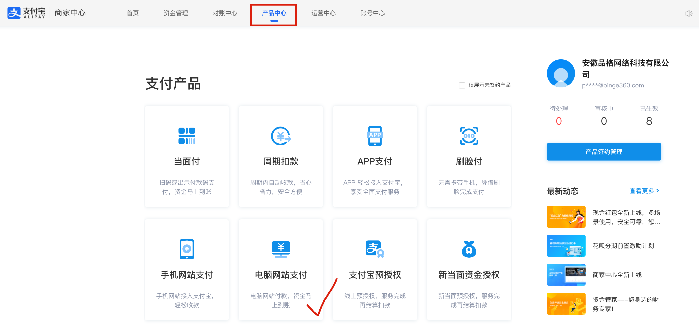
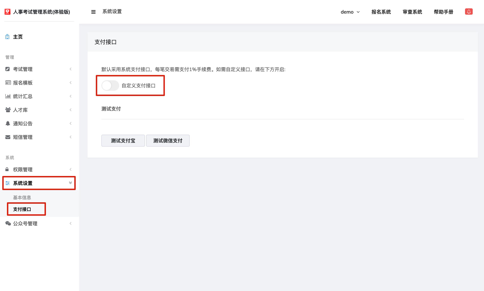
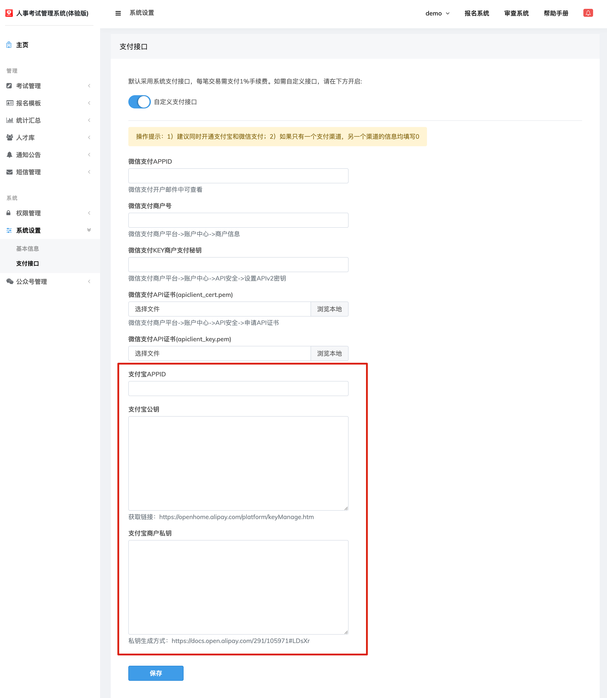

# 如何开通支付宝支付接口？

## 1、登录支付宝商户平台

[支付宝 (alipay.com)](http://b.alipay.com)

企业费率：https://cshall.alipay.com/enterprise/knowledgeDetail.htm?knowledgeId=201602188869

政府/机关费率：https://cshall.alipay.com/enterprise/knowledgeDetail.htm?knowledgeId=201602333620

## 2、注册前按照下图准备好相应材料

## 3、注册成功支付宝商户版之后，请进入【产品中心】，开通下图中打勾的支付产品

## 4、进入考试报名管理系统管理后台

进入【系统设置->支付接口】页面，开启【自定义支付接口】

按表单顺序依次填写相应信息。

信息获取方式，可参考表单下方的说明文字。

填写完毕，点击保存。

支付宝商户版及支付接口，设置完毕。

## 常见问题处理

[蚂蚁集团帮助中心 (alipay.com)](https://cshall.alipay.com/enterprise/index.htm)