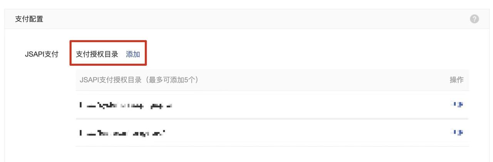
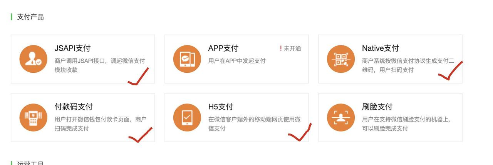
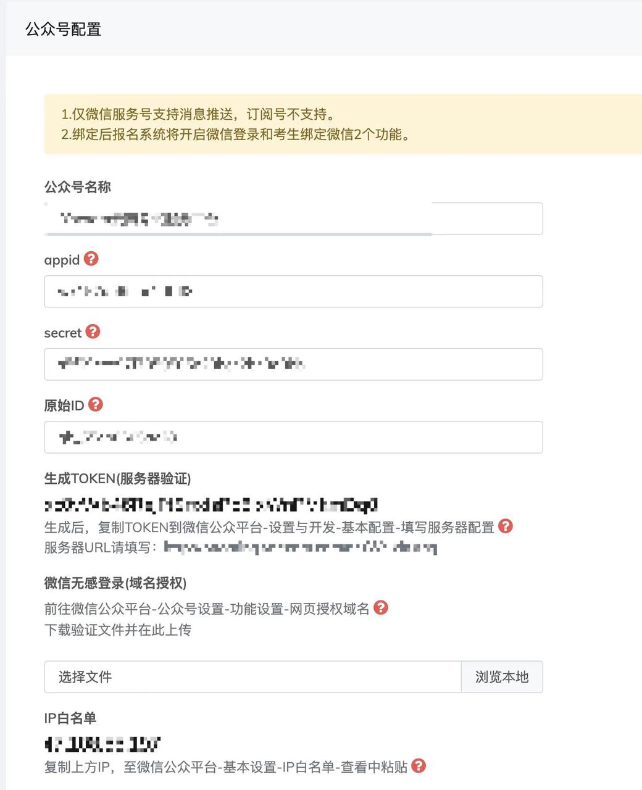

# 如何配置微信移动端支付功能？

## 1）支付授权目录：**添加您的报名端系统域名**

请前往微信支付商户平台->产品中心->开发配置

**域名后面需要后缀wxpay，例:http://exam.ikaowu.com/**

## 2）确认已经开通**JSAPI支付**功能

查看路径：微信支付商户平台->产品中心

## 3）登录报名系统后台->公众号管理->公众号配置

填写公众号配置页面的所有信息，完成公众号绑定。

**注意：因微信移动端支付必须采用公众号支付接口，因此必须完成报名系统和公众号绑定后才可实现微信移动端支付。**

