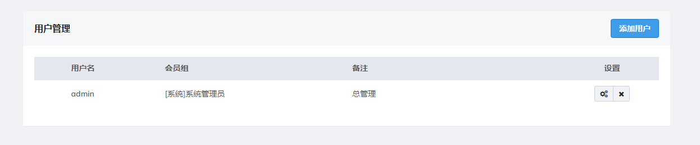
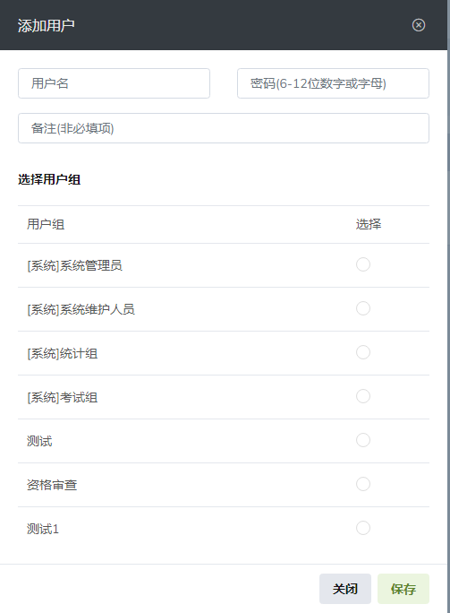
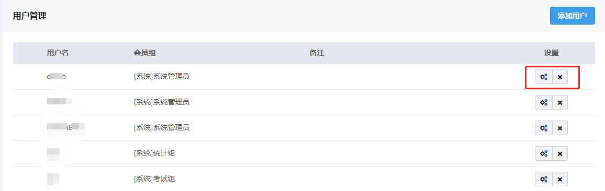
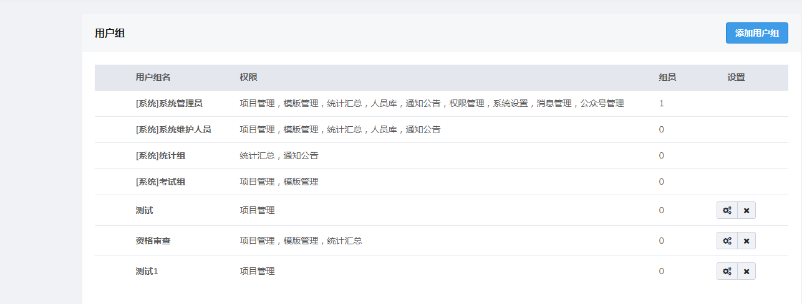
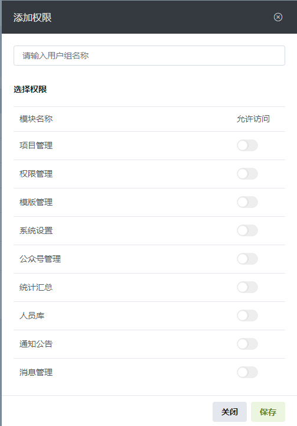
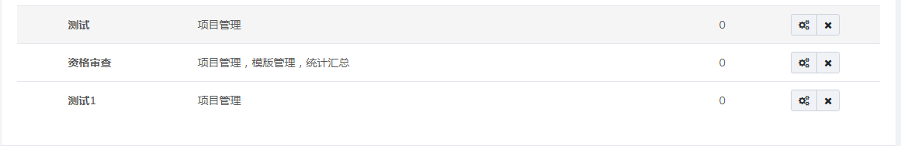

# 权限管理

根据系统设置的安全规则或者安全策略，既定用户可以访问而且只能访问自己被系统管理员授权的目录。
权利不同可以了解的数据内容不同，保证数据隐私，避免数据泄密；职责不同所需要页面不同，保证操作效率，避免页面干扰；技术水平不同可以操作的功能不同，保证系统安全，避免操作风险。

## 用户管理

### 添加用户

点击**添加用户**后会出现如下画面

输入用户名账号密码，选择用户组完成用户创建

### 编辑用户

点击编辑按钮即可修改该用户的信息

## 用户组

### 添加用户组

点击**添加用户组**后会出现如下画面

输入用户组名称，并选择该用户组权限（可多选）

### 编辑用户组

点击编辑按钮即可在弹出的窗口中修改该用户组的名称和所属权限（非系统用户组添加后可以删除)
