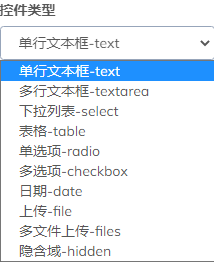
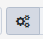

# 模板管理

## 表单字段

该模块是设置报名人员报名时所填写的信息，字段分为 **系统字段** 、**特殊字段**以及 **自定义字段**

**系统字段**

系统字段包含了常用的一些字段，包括姓名，出生年月，最高学历，毕业院校，所学专业等，系统字段不允许修改。

**特殊字段**

特殊字段包括学信网在线验证码以及教师资格证证书号码

**自定义字段**

对于要使用的字段系统里没有时，需要创建自定义字段

**新增字段**

点击页面右上角的弹出以下窗口

**控件类型**

**字段名称**

填写中文名称的拼音首字母，不得与系统字段和其他自定义字段重复

**字段含义**

填写该字段的简要名称

**值**

在设置下拉列表，表格，单选项，多选项时需要提供选项让报名人员选择。选项用 **“|”** 分割，例如 **男|女**

**字段说明**

对该字段的说明,一般显示在报名信息填写框下方

> 自定义字段添加完成后，需要插入在指定报名模板中方可使用，具体方法见**模板编辑**

---

## 模板列表

### 模板编辑

每个模板创建或者修改的时间可以在列表中查询到，最新创建和修改的显示在最上方

点击已删除的模版可以在此页面查看历史记录

点击进入模板编辑页面

左边是所有的系统字段和自定义字段，右边是当前选取的字段

在左边区域选取需要的字段，点击移入右边

同样，右边不想要的字段，选中后，点击移入左边

在右边，选中任一字段，点击可调整字段顺序

上传类字段需注意，必须上传文件需要勾选，非必须上传不勾选

> 字段的前后顺序必须对应着报人员填报信息时的字段顺序进行排序

### 模板克隆

点击按钮，会克隆出一个除用户名外一模一样的模板，用户只需要在克隆出来的木板上修改即可

> 如需要创建新的模板，建议克隆其他模板，再进行修改

### 预览

点击任一模板中的进入报名预览页面

页面中会按照模板编辑时选出的字段，按顺序列出报名人员需要填写的所有信息

具体页面截图如下

### 报名表

在审核报名信息和对报名人员进行资格审查时需要用的表

点击进入设置页面

带"{ }"的英文代表报名人员所提交的字段值

**插入字段值**

点击

选择需要插入的字段，在表格中点击确定需要插入的位置，点击即可插入该字段

**表格操作**

合并单元格：选中两个或以上单元格，右键

即可合并单元格

拆分单元格：右键任一需要拆分的单元格，点击

即可拆分

单元格居中：点击任一需要居中显示的单元格，点击

即可将内容居中显示

插入行：点击你想插入行位置的上下方单元格，右键

即在当前单元格上下方插入行

插入列：点击你想插入位置的单元格，右键

即可在左右侧插入列

删除整个表：选择表格，右键选择**删除表格**即可删除

删除行：选择你想删除的那一行，右键选择**行-删除行**即可删除

删除列：选择你想删除的那一列，右键选择**列-删除列**即可删除

**设置表格边框**

右键表格进入表格属性

可对表格的宽，高，对齐方式等属性进行设置

点击**高级**

可对表格边框宽度样式以及颜色进行设置

**设置单元格**

右键单元格进入单元格属性设置

可对单元格的宽，高，对齐方式等属性进行设置

点击**高级**

可对单元格边框宽度样式以及颜色进行设置
