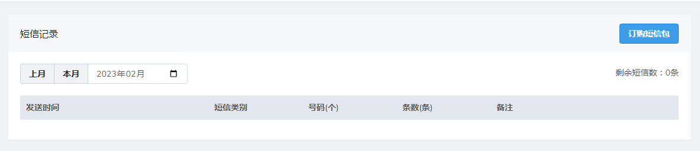
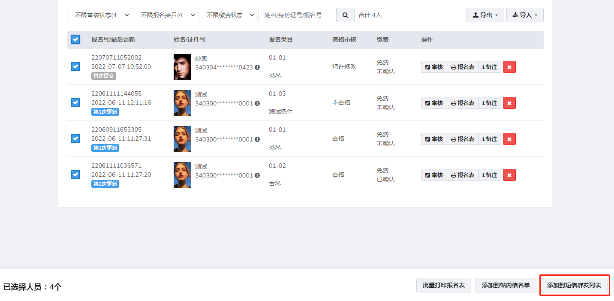
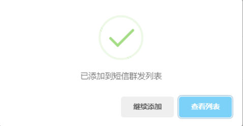
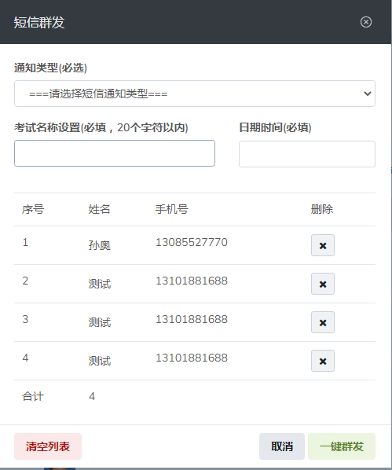
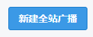
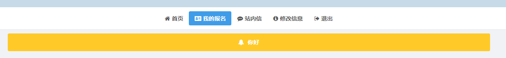
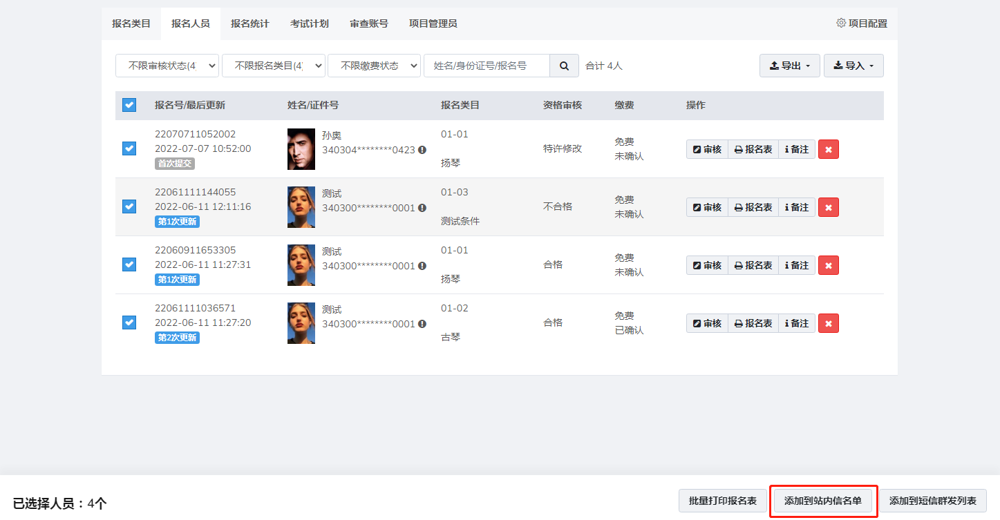
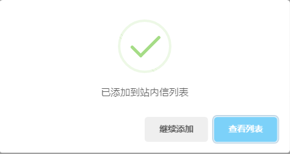
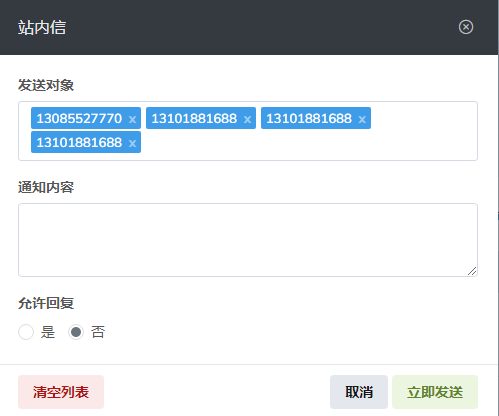

# 消息管理

## 短信记录

短信记录里详细记录了已群发的短信，包含短信的发送时间，短信类别，群发号码，使用短信条数等

可点击**订购短信包**购买短信套餐

**添加群发人员**

进入报名人员列表勾选需要群发短信的人员，此时底部会出现选择按钮，点击添加到短信群发列表

添加成功后，点击**查看列表**

内容填写好确认无误后点击**一键群发**即可完成短信发送

**通知类型**：通知类型分为以上多个类型，也可以自定义信息模板新增的通知类型需提交云平台审核添加短信模板

**项目名称**：项目名称对应通知短信中的报人员名称，默认为该场考试的考试名称

**日期时间**：项目名称对应通知短信中的通知类型截止日期，默认为空，必填。

注：每条短信默认70字以内，若短信内容超过，则会发送两条短信。

------

## 站内信

点击可以添加广播通知内容

全站广播会对所有注册用户发送消息内容，用户在登录后即可查看

**添加站内信名单**

进入报名人员列表勾选需要发送站内信的人员，此时底部会出现选择按钮，点击添加到站内信名单

添加成功后，点击**查看列表**

可填写通知内容以及设置是否允许考生回复，设置完成后点击**立即发送**完成站内信发送