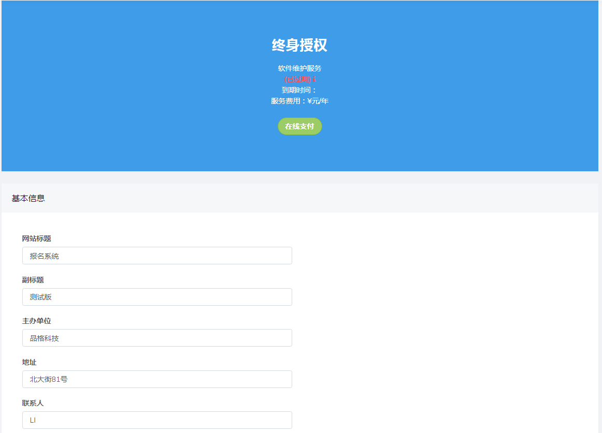
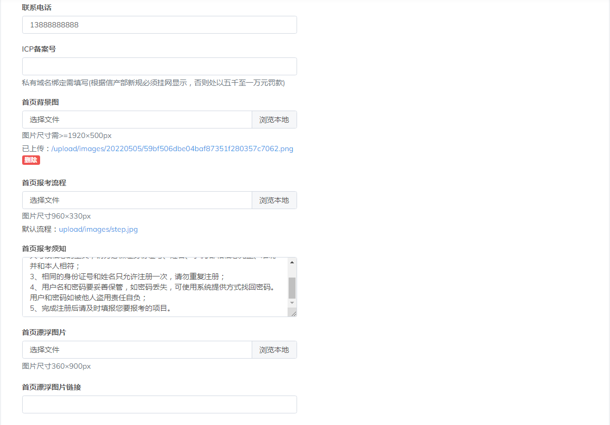
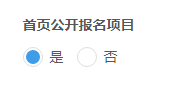
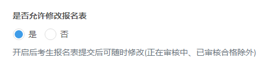
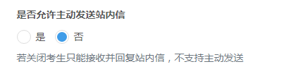

# 系统设置

## 基本信息

可查看系统版本和套餐详情，报名端主页内容配置

**首页公开报名项目**

点击”是“或“否”可以开启，关闭报名主页项目公开信息

**修改报名表**

点击”是“或“否”可以开启，关闭允许报名人员修改报名表功能

**发送站内信**

点击”是“或“否”可以开启，关闭报名人员主动发送站内信功能

------

## 支付接口

默认采用系统支付接口，每笔交易需支付1%手续费。如需自定义接口，请开启自定义支付。