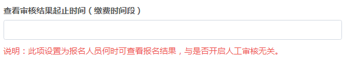
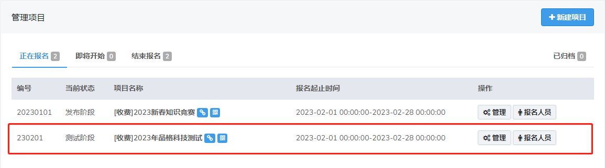
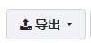
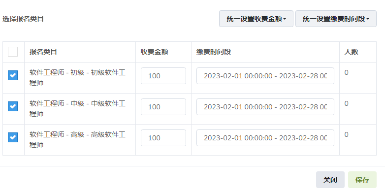

# 项目管理

## 新建项目

**创建项目**

点击新建项目，即可创建新的项目。

新建项目需要填写将“基本信息”、“报名配置”中必填选项填写完成，项目才可保存。

（1）基本信息必填项：项目编号-项目名称-选择报名模板。

**项目编号**
系统建议的项目编号格式为(六位数字)：年份后两位 + 月份（01,02,...,12）+ 日期（01,02,...,31）,例如230201。

（2）报名配置必填项：收费类型-报名起止时间-审核起止时间-查看审核结果起止时间（缴费时间段）。

报名配置中需要特别注意报名、审核和审核结果查询时间选择，若是修改起始时间会变动，需要核对无误再保存。

**自动审核**

关闭人工审核功能后符合条件的报名人员可自动审核通过。

**多类目填报**

可根据项目需要选择是否允许填报多个类目。

**公开报名**

选择不公开报名，报名端无法查看报名项目，可用于内部报名。

**报名人数公开**

开启后报名人员可查看项目中各类目报名情况，关闭后不可查看。

**考生确认**

报名配置中设定是否需要考生在审核结果查询截止时间前确认参加考试，没有确认的考生默认取消资格，有助于减少考试计划中的资源浪费。

**报名状态**

为了避免出错，请在创建时，将项目状态设置为 **测试阶段**， 具体操作会在 **报名端测试流程**中详细说明。处于测试阶段时，只有人员状态为高级用户时，才会看到该场考试（人员状态功能会在 **人员库**中详细说明）。当报名功能测试完成后，即可恢复考试报名时间，并且将项目状态设置为**发布阶段**。

（3）其他：报名须知-承诺书-达到报名人数后弹窗提示及提示内容-注意事项

**报名须知**

填写报名须知保存后报名人员选择报名项目是会如下图所示弹窗，报名人员点击我已阅读后方可进行后续操作

**承诺书**

填写承诺书保存后报名人员阅读报名须知后是会如下图所示弹窗，报名人员点击我同意后方可选择类目进行后续操作

**注意事项**

注意事项填写后，报名人员报名时内容会在类目上方显示。

填完所有基本内容点击保存,可以在项目管理中查找我们刚创建的项目。

**项目时间线**

 项目列表页鼠标移入报名起止时间即弹出该项目时间线预览，可核对时间设置是否正确，若不正确可在管理-项目配置修改保存。

**项目状态**

根据报名起止时间的设置，可以把项目分为三类，正在报名，即将开始，结束报名。

**新增已归档类别：把已结束的项目进行存档。**

> 报名类目的设置需在报名开始时间前设置完毕，当报名开始时，请慎重修改报名类目信息。

****

## **类目管理**

**报名类目**

可以根据缴费类型或者搜索框搜索筛选类目

**分类管理**

点击分类管理，会出现以下窗口

可进行大分类和子分类的添加修改

**新增报名类目**

点击新增报名类目，会出现以下窗口

- 如没有类目代码，请用01，02，03代替
- 报名模板 功能将会在**模板管理**中详细说明
- 报名费用：填写报名人员所需缴纳的费用
- 报名要求：对于该类目的要求，如学历要求或者年龄要求等。报名人员选择该类目时会看到内容要求
- 报名条件：设置报名条件后，系统在考生报名时会自动拒绝不符合条件的报名，具体设置如下图所示
- 接受报名：可选择正常接受报名和暂停接受报名，选择暂停接受报名后报名人员无法提交填报资料

- 如报名条件为：学历本科及以上，则条件应该把本科和本科以上的学历都选择添加。若有年龄要求，则在年龄输入框中输入生日起点限制。
- 在 **模板管理 - 表单字段 - 自定义字段**中新建的非文本类型字段，并插入到报名列表中，也会出现在报名条件中。

**修改类目**

点击按钮即可查看并修改已添加的职位

**复制类目**

为简化操作，若有类似职位可点击复制按钮，在弹出的框中修改为新增职位即可快速新建其他类目。

**导出报名类目数据，导入报名类目信息**

点击导出报名类目数据空表

填写需要添加的报名类目信息

> 导出后需要选中表格全部内容，把单元格格式设置为文本，日期以XXXX-XX-XX格式填写，涉及到数值类的内容用数字填写

点击弹出

把编辑好的报名类目数据表上传，导入成功后弹窗提示

系统报名类目里显示导入信息内容

> 导入前需要创建好报名模板并在报名配置里选择项目需要使用的模板

**项目报名人数显示**

可查看每个报名类目报名人数

---

## 报名人员

- 系统会根据报名的**时间顺序由后至先**排序
- 点击**审核**可查看报名人员报名表信息进行审核
- 点击**报名表**可查看报名表内容和打印
- **备注** 是对报名人员的备注说明，鼠标移动到备注上即可查看
- 鼠标放在**缴费状态** 上可以看到考生缴费时间、金额、方式
- 已缴费考生重新审核不合格后可点击退费按钮进行退费

**筛选**

选择需要筛选的条件，系统将自动筛选出符合条件的考生。也可根据搜索框搜索查找报名人员。

**导出**

点击按钮，即可导出所有报名人员的报名详细数据，审查结果以及改报记录等信息。

（下图为导出的报名表，可以修改内容点击重新上传)

**导入**

点击按钮，即可导入报名信息，审查结果以及批量上传照片

**审核**

点击按钮，会弹出如下审核窗口

审核人员根据报名人员所填的信息，确定报名人员是否符合报名资格，并在审核表下方勾选审核结果。

审核通过的报名人员进入缴费阶段，未通过审核的考生可修改报考信息再提交审核。

**取消资格**、**特许修改**、**自愿放弃**这三项只在后台显示，审查系统无此三项；如若使用这三个按钮，请到后台管理系统操作。

---

## **报名统计**

可查看项目报名类目以及各类目报名人数，审核通过人数，缴费人数，缴费金额信息，也可以导出数据表进行查看

------

## 考试计划

点击，会弹出如下考试配置窗口

填写考试相关信息，选择准考证打印和成绩查询时间

勾选需要参加考试的报名类目，根据项目需要设置**收费金额**和**缴费时间**（报名类目中已经设置缴费收费金额缴费时间段可不设置）

设置完成后保存完成考试计划创建

点击进入考生页面

可根据打印状态，缴费状态以及选择查询项目在搜索框查询考生数据

**导入考生数据**

点击导入，导入开考试初始数据 

下载审核通过（缴费）名单模板，编辑表格数据完成后上传

**批量导入成绩**

下载考生数据模板文件

模板文件内容编辑完成后上传成绩，成绩查询时间开放后报名端已报名项目后面显示查询按钮

点击即可查询成绩

**导出**

可批量打印准考证和导出考生数据

**准考证**

进入准考证模板，添加编辑准考证内容完成后保存

点击查看准考证内容

点击弹出考试信息编辑窗口，可对考生信息进行修改

点击可删除该条考生数据

**证书管理**

创建考试计划开启证书管理功能

点击进入证书管理

点击**导入**可导入证书信息和证书附件

导入附件名称必须与信息里的证书编号一致

点击可设置证书类型和获取方式以及发放/领取时间

其中纸质证书可选择自取或邮递两种方式，设置领取时间后报名端已报名项目后面显示按钮

根据不同领取方式点击即可下载证书电子件或查看自取地址和邮递详情

------

## 审查账号

点击 进入审查用户添加页面

> 审查人员权限仅限于报名的审核，且当审核时间结束后，审查人员的权限终止，后续步骤需在系统管理后台完成。

> 该系统下所有审核人员账户用户名不能重复。

> 审查用户后台网址会在系统建设完成后提供，具体表现形式参考**考生列表**

（备注：审查系统无法审核的情况下是因为考试配置中审核时间还未开始。超级管理员不会受到此限制，如有问题可以及时与我们联系）

------

## 项目管理员

点击进入用户添加页面

设置用户名和密码后保存项目管理员即可完成创建
