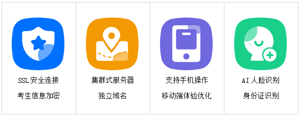
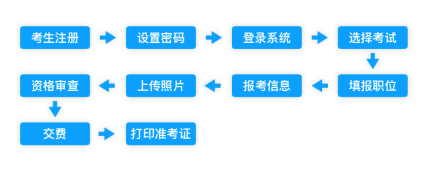

# 系统简介

人事考试(报名)管理系统是为各地人社劳动部门、教育系统、医疗系统等大型企事业单位及人力资源机构，提供的一整套覆盖人事招聘、考试(报名)全业务流程的SAAS软件系统。

系统包含了网上报名、资格审查、在线缴费、考场编排、准考证生成及打印、成绩查询、面试通知单、面试缴费等人事考试的全套业务流程。

## 系统特色

## 系统技术特点

1. HTTPS/SSL安全连接，加强系统信息安全保障
2. 集群式服务器，更强大的运算处理能力，避免单点故障，支撑力更强
3. 考生信息加密，通过哈希算法实现32位数字签名，保障考生信息安全
4. 采用最新的AI人脸识别、身份证识别、照片在线剪切等技术，有效降低冗余信息
5. 支持各种类型考试业务，各项参数可自定义，覆盖全业务流程
6. 独立域名、自定义LOGO、网站名称、定制前台网站界面
7. 独立加密的审查人员系统，与主系统独立，业务分离更安全
8. 支持移动端报名，方便考生随时随地查阅考试信息
9. 支持微信公众号对接，实现定向笔试、面试、成绩通知等
10. 支持人才库，考生自动进入人才库，简历自动备份，实现人才检索与信息储备

## 报名流程

 

