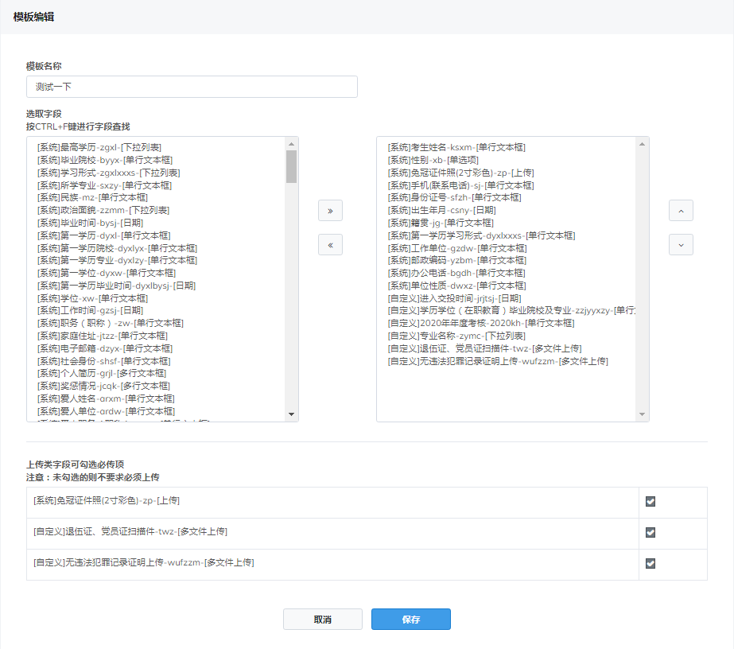
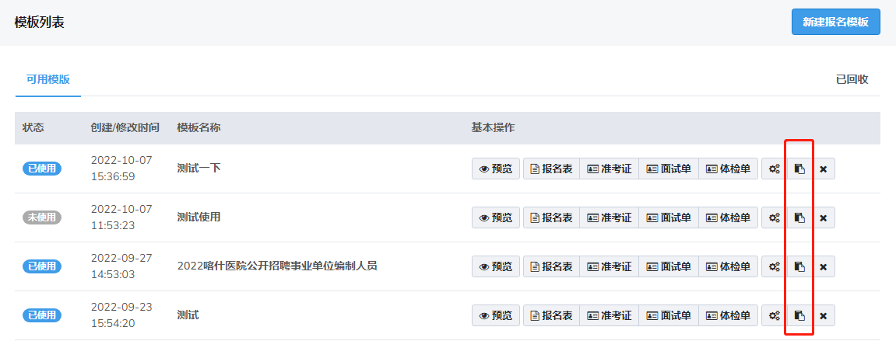
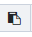

# 模板管理

## 表单字段

该模块是设置考生报名时所填写的报考信息，字段分为 **系统字段** 、**特殊字段**以及 **自定义字段**

**系统字段**

系统字段包含了常用的一些字段，包括考生姓名，出生年月，最高学历，工作经历，教育经历等，系统字段不允许修改

**特殊字段**

特殊字段包括学信网在线验证码以及教师资格证证书号码

**自定义字段**

对于要使用的字段系统里没有时，需要创建自定义字段

**新增字段**

点击页面右上角的弹出以下窗口

**控件类型**

**字段名称**

填写中文名称的拼音首字母，不得与系统字段和其他自定义字段重复

**字段含义**

填写该字段的简要名称

**值**

在设置下拉列表，表格，单选项，多选项时需要提供选项让考生选择。选项用 **“|”** 分割，例如 **男|女**

**字段说明**

对该字段的说明,一般显示在考生信息填写框下方

> 自定义字段添加完成后，需要插入在指定考试中方可使用，具体方法见**模板编辑**

---

## 模板列表

### 模板编辑

每个模板创建或者修改的时间可以在列表中查询到，最新创建和修改的显示在最上方

点击已删除的模版可以在此页面查看历史记录

点击进入模板编辑页面

左边是所有的系统字段和自定义字段，右边是当前选取的字段

在左边区域选取需要的字段，点击移入右边

同样，右边不想要的字段，选中后，点击移入左边

在右边，选中任一字段，点击可调整字段顺序

上传类字段需注意，必须上传文件需要勾选，非必须上传不勾选

> 字段的前后顺序必须对应着报名考生填报信息时的字段顺序进行排序

### 模板克隆

点击按钮，会克隆出一个除用户名外一模一样的模板，用户只需要在克隆出来的木板上修改即可

> 如需要创建新的模板，建议克隆其他模板，再进行修改

### 预览

点击任一模板中的进入考生报名预览页面

页面中会按照模板编辑时选出的字段，按顺序列出报名考生需要填写的所有信息

具体页面截图如下

### 报名表

在审核考生报名信息和对考生进行资格审查时需要用的表

点击进入设置页面

带"{ }"的英文代表考生所提交的字段值

**插入字段值**

点击

选择需要插入的字段，在表格中点击确定需要插入的位置，点击即可插入该字段

**表格操作**

合并单元格：选中两个或以上单元格，点击

即可合并单元格

拆分单元格：点击任一需要拆分的单元格，点击

即可拆分

单元格居中：点击任一需要居中显示的单元格，点击

即可将内容居中显示

向上插入行：点击你想插入行位置的下方单元格，点击

即插入前行

向下插入行：点击你想插入行位置的上方单元格，点击

即插入前行

向左插入列：点击你想插入行位置的右方单元格，点击

即插入前列

向右插入列：点击你想插入行位置的左方单元格，点击

即插入后列

删除整个表：选择表格，右键选择**删除表格**即可删除

删除行：选择你想删除的那一行，右键选择**行-删除行**即可删除

删除列：选择你想删除的那一列，右键选择**列-删除列**即可删除

调整边框

设置好边框已经有改变，但是表格内单元格没有边框，进行下一步设置

### 准考证/面试单

考生参加笔试/面试时需携带的准考证，点击任一考试的准考证或面试单进入编辑页面

默认的笔试准考证含有，考生照片，准考证号，姓名，报考好，身份证号，报考岗位，考试时间，考场规则等

用户可根据需求自定义笔试/面试准考证

准考证模板设置可参照报名表 

### 体检单

考生参加体检时需携带的体检单，点击任一考试的体检单进入编辑页面

根据需要编辑体检单模板，完成后点击保存即可
