# 消息管理

## 群发记录

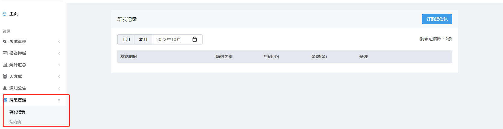

群发记录里详细记录了已群发的短信，包含短信的发送时间，短信类别，群发号码等

**添加群发人员**

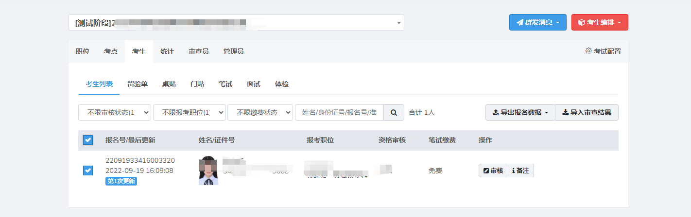

进入考生列表勾选需要群发短信的考生，此时底部会出现选择按钮

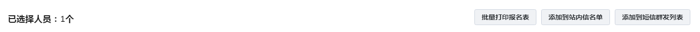

**站内信群发**

点击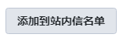将勾选的考生添加至站内信名单

点击 可以查看到已添加至站内信名单，截图如下

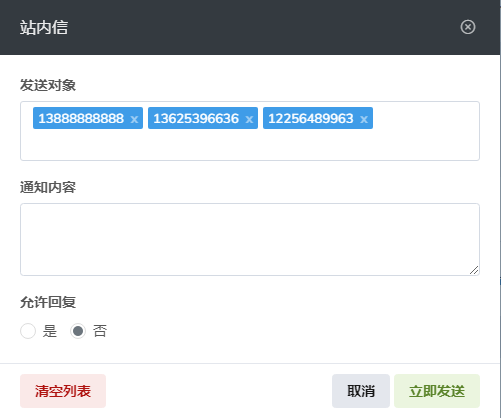

可以设置站内信是否允许考生回复，确认发送对象，编辑好通知内容点击立即发送即可

**短信群发**

点击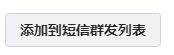将勾选的考生添加至短信群发列表。

点击  可以查看到已添加至群发列表的考生，截图如下

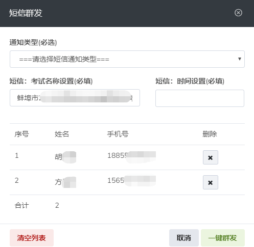

**通知类型**

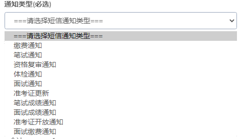

通知类型分为以上多个类型，也可以自定义信息模板新增的通知类型需提交云平台审核添加短信模板

**考试名称**

考试名称对应通知短信中的考生名称，默认为该场考试的考试名称

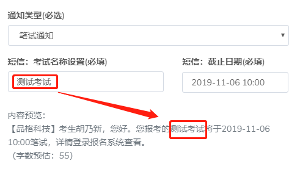

**截止日期**

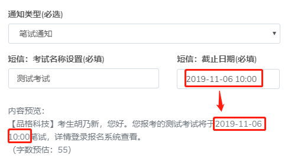

考试名称对应通知短信中的通知类型截止日期，默认为空，必填。

**发送限制**

每条短信默认70字以内，若短信内容超过，则会发送两条短信，以此类推。

## 站内信

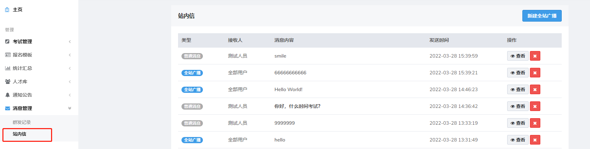

可以查看考生和管理员的对话，包括接收人，消息内容，发送时间等

点击可以添加广播通知内容

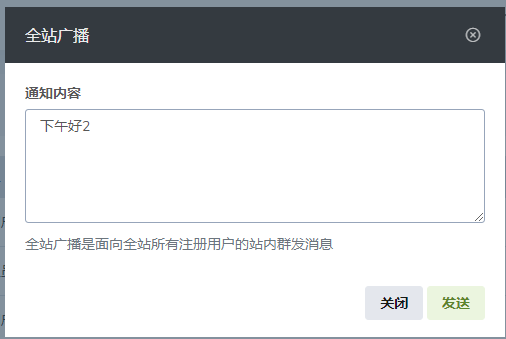

全站广播会对所有注册用户发送消息内容，用户在登录后即可查看

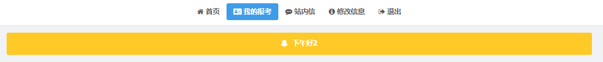

**删除站内信**

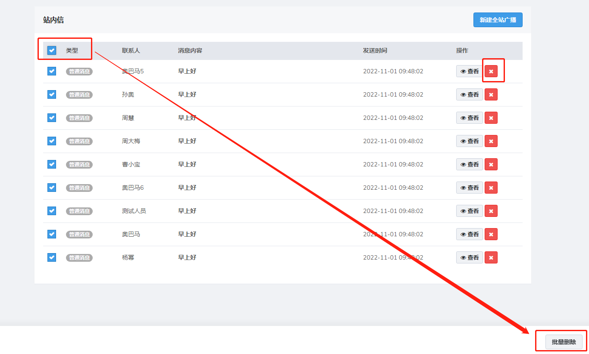可选择需要删除的站内信进行批量删除