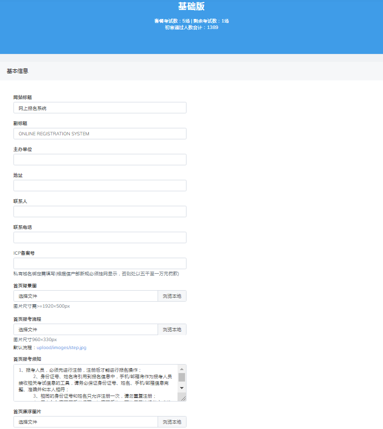
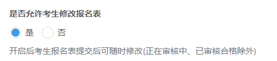
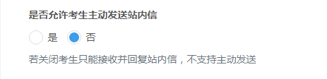
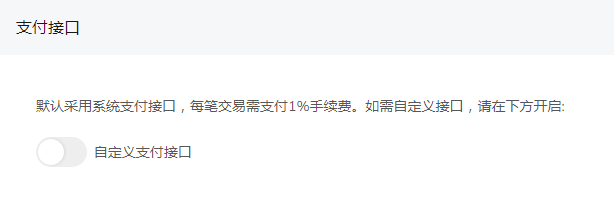

# 系统设置

## 基本信息

可查看系统版本和套餐详情，报名端主页信息配置

**考试报名入口**

点击”是“或“否”可以开启，关闭报名主页考试公开信息

**考生修改填报**

点击”是“或“否”可以开启，关闭考生允许修改报名表功能

**考生发送站内信**

点击”是“或“否”可以开启，关闭考生主动发送站内信功能

## 支付接口

默认采用系统支付接口，每笔交易需支付1%手续费。如需自定义接口，请开启自定义支付。