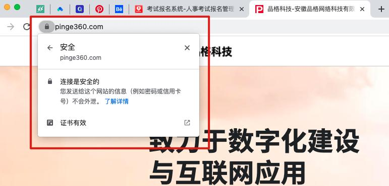

# 常见问题解答

## 什么是https加密传输？

HTTPS （全称：Hyper Text Transfer Protocol over SecureSocket Layer），是以安全为目标的 HTTP 通道，在HTTP的基础上通过传输加密和身份认证保证了传输过程的安全性。被广泛用于万维网上安全敏感的通讯，例如交易支付等方面。

## 考生如何填写诚信承诺书？

承诺书可以作为附件让考生签字后上传。

也可以采用电子方式，即：报名前需点击确认承诺书才可报名（但不会生成电子文件）。

## 如何实现考生移动端支付？

首先需要完成公众号配置，在公众号管理-公众号配置中完成公众号的绑定才可实现移动端支付。

## 附件上传的大小要求？

图片格式的附件没有大小限制，系统会进行自动压缩。

pdf格式的附件，大小不能超过1M。