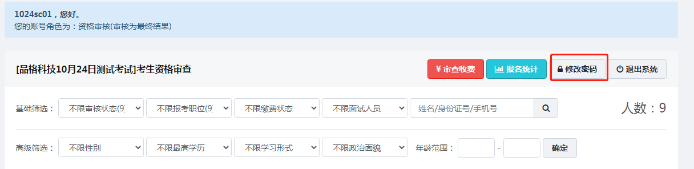

# 考试管理

## 新建考试

**创建考试**

点击新建考试，即可创建一场新的考试。

新建考试需要填写将“基本信息”、“考试配置”中必填选项填写完成，考试才可保存。

基本信息必填项：考试编号-考试名称-选择报名模板

**考试编号**
系统建议的考试编号格式为(六位数字)：年份后两位 + 月份（01,02,...,12）+ 日期（01,02,...,31）,例如190101

（2）考试配置必填项：选择考试类型-举办机构-收费类型-报名起止时间-审核起止时间
考试配置中需要特别注意报名时间选择，若是修改起始时间会变动，需要核对无误再保存。审核结束时间应设置晚于报名时间。

**考生确认**

考试配置中设定是否需要考生在审核结果查询截止时间前确认参加考试，没有确认的考生默认不编排进入考场，有助于减少考场编排中的资源浪费。

**报名系统服务费**

 说明：如果向考生收取报名系统服务费，请填写具体金额，不收取该费用请填写0或者不填写。(报名系统服务费不支持退款,,若设置报名系统服务费，考生未缴费无法查看报名表，管理端看不到考生报名信息；考生缴费完成后可以看到考生报名信息进行审核)

**准考证号**

准考证生成规则： 一般默认是前缀（一般6位数）+考场号（3位补全）+座位号（2位补全）共11位数，例如21011500101，也可以自定义准考证号，可以编入考点和职位代码，由于excel特性，最长不要超过15位数。
3位补全是设置号码为1，系统自动生成001；2位补全是设置为1，系统自动生成01；自动是设置号码为1，系统生成为1。

（3）笔试配置项目：（可根据实际情况选填，收费考试须设置笔试支付起始时间，免费考试不须设置，其他项目须根据公告内容填写可跳过不填，保存考试即可）

（4）面试配置项目：（可根据实际情况选填，收费考试须设置面试支付起始时间，免费考试不须设置，其他项目须根据公告内容填写可跳过不填，保存考试即可）

填完所有基本内容点击保存,可以在考试项目中查找我们刚创建的考试

点击.jpg)查看报名端考试项目主页

可在考试配置-其他选项中开启开启关闭项目流程状态

**考试状态**

> 为了避免出错，请在创建考试时，将考试状态设置为 **测试阶段**， 具体操作会在 **[测试流程](https://www.kancloud.cn/pinge/ksxt/2104800)** 中详细说明。处于测试阶段时，只有考生状态为高级用户时，才会看到该场考试（考生状态功能会在 **[人才库](https://www.kancloud.cn/pinge/ksxt/1359414)** 中详细说明）。当报名功能测试完成后，即可恢复考试报名时间，并且将考试状态设置为**发布阶段**。

**门贴标题**

.jpg)

后期笔试配置中需要填写，一般和公告考试名称一致

二、考试项目列表页鼠标移入报名时间即弹出该考试所有时间线预览

可核对时间设置是否正确，如若不正确可点击考试配置修改保存

---

## 职位管理

根据设置的报名日期，把考试分为三类，正在报名，即将开始，结束报名。

**新增已归档类别：把已结束的考试进行存档。**

> 职位的设置需在报名日期前设置完毕，当报名开始时，请慎重修改职位信息。

**职位筛选**

.png)

可以根据职位缴费类型以及考试类型或者搜索框搜索筛选职位

**新增职位**

点击新增职位，即会出现以下窗口

**正常/暂停接受报名**

通过下拉框选择职位是否接受报名，暂停接受报名考生报名时没有该职位选项

- 如没有职位代码，请用01，02，03代替
- 报名模板 功能将会在 模板管理中详细说明
- 考试科目代码：如果有两门或以上科目，请用 | 分割，例如（01|02）
- 笔试起止时间：如果有两门或以上科目，请用 | 分割，例如（9:00-11:00|14:30-16:30）
- 考试科目名称：如果有两门或以上科目，请用 | 分割，例如（职业能力测试|申论）
- 笔试成绩标签：如果有两门或以上科目，请用 | 分割，例如（职业能力测试|申论）
- 职位要求：针对该岗位的招聘需求，如学历要求或者年龄要求等。考生选择报考该岗位时会看到所填内容
- 报名条件：设置报名条件后，系统在考生报名时会自动拒绝不符合条件的报名，具体设置如下图所示

- 如招考条件为：本科及以上，则条件应该把本科和本科以上的学历都选择添加。若有年龄要求，则在年龄输入框中输入生日起点限制。
- 注：在 **模板管理 - 表单字段 - 自定义字段**中新建的非文本类型字段，并插入到报名列表中，也会出现在报名条件中。

**编辑职位**

点击按钮即可查看并修改已添加的职位

**复制职位**

为简化操作，若有类似职位可点击

复制按钮，在弹出的框中修改为新增职位即可快速新建其他职位。

**导出职位数据，导入职位信息**

点击.png)导出职位数据空表

填写需要添加的职位信息

.png)

> 导出后需要选中表格全部内容，把单元格格式设置为文本，日期以XXXX-XX-XX格式填写，开考比例使用1:X格式填写，其中":"用英文填写，涉及到数值类的内容用数字填写

点击弹出

把编辑好的职位数据表上传，导入成功后弹窗提示

职位里显示导入信息内容

.png)

> 导入前需要创建好报名模板并在考试配置里选择需要使用的模板

**职位报名人数显示**

---

## 考点管理

**新增考点**

点击新增考点，即会弹出以下窗口

- 考点编号：若没有特定编号，则按默认编号01，02填写
- 考点名称：考试地点，比如某某学校，某某考试基地
- 考点地址：具体详细地址，比如某个区多少号几楼
- 备       注：考生前往考点的交通说明等其他内容

**编辑考点**

点击任一创建好的考点后的编辑按钮，即可修改考点信息

### 考场管理

> 请在报名，审核，缴费全部结束，确定考生人数后再编排考场

点击任一考点后的考场按钮，即可进入考场编排页面

点击按钮，会弹出如下窗口

考场座位数默认为30，可修改为任一数字。点击预览按钮后，系统会根据考生人数以及考场座位数，按照职位顺序创建考场座位预览表。确认没问题后，点击

即可生成考场。

**批量添加考场**

点击按钮，会弹出如下窗口

选择对应的考试科目(职位)，会显示该职位下待编排人数。可以添加编排范围条件对考生进行筛选编排。若考场终止编号y不等于起始编号x，保存成功后，则会出现y-x+1个考场。

**添加技巧**

若职位1有59人，每个考场有30张座位，则在批量添加考场时，考场起始编号为1，终止编号为2，终止座位号为30，保存后会出现两个考场。这时，只需要在第二个考场，修改终止座位号为29，即可创建完成。

如果座位连续，则2考场剩余的1个座位则需要单独添加。点击批量添加考场，考试科目选择科目2，考场起始编号填2，终止编号填2，起始座位号为30，终止座位号为30。随后第三考场继续排入职位2的考生即可。

> 注意：自定义编排考场任务之细，需要谨慎编排，认真检查，若中间有任一考场出错，则后续的考场都需要修改。

# 

面试考点，考点类型选择面试，编号名称根据实际填写，备注可以填写时间，实现把不同考生分在不同时间面试操作

---

## 考生管理

考生列表：查看并审核考生

编排考场：报名，审核，缴费，创建考场完成后，将考生编排至考场中

留言单：每个考场的所有考生表，打印用，方便考官对考生签到

桌贴：考场座位上的考生身份贴纸，打印用，方便考生确定座位

门贴：每个考场的考试信息，打印用，方便考生和考官确定考场

笔试：所有进入笔试的考生名单，可下载笔试考生表，下载空白成绩表，上传填好的成绩表

面试：所有进入面试的考生名单，缴费状态表示最终进入面试的名单

### 考生列表

- 系统会根据报名的**时间顺序由后至先**排序
- **准考证号** 在编排考场完成才会确定
- **备注** 是对考生的特殊说明或者是考试加分政策及其他
- 鼠标放在**缴费状态** 上可以看到考生缴费时间、金额、方式

**筛选**

选择需要筛选的条件，系统将自动筛选出符合条件的考生。

**导出报名数据**

点击

按钮，即可导出所有（包含不合格）考生的所有报名信息。

（下图为导出的报名表，在红线框内可以修改是否合格及原因）

**导入**

点击导入审核结果按钮，即可导入

（首先导出未审核的报名表，表格格式默认为Excel格式，报名表审核完毕后在点击导入即可）

**审核**

在审核时间段内，列表显示为下图

点击按钮，会弹出如下审核窗口

审核人员根据考生所填的信息，确定考生是否符合报考资格，并在审核表下方勾选审核结果。

审核通过的考生进入缴费阶段，未通过审核的考生可修改报考信息再提交审核。

取消资格、特许修改、自愿放弃这三项只在后台显示，审查系统无此三项；如若使用这三个按钮，请到后台系统点击。

报名，审核，缴费，编排考场完成后，进入笔试的考生会添加按钮，点击按钮即可看到考生的准考证。

### 编排考生

#### 笔试编排

笔试考场编排之前需完成创建考点、考场、准考证号，门贴标题，并确保创建的准确性。

弹出窗口会展示出每个职位的考生数，以及考场的座位数，请核对确保准确。

**编排方式**

1.自动打乱：指职位顺序不变，每个职位里的考生随机编排

2.报名顺序：指职位顺序不变，每个职位里的考生按报名顺序编排

**已编排人员处理方式**

1.清除数据，重新编排

2.保留数据，不对齐编排

注：适用于分批次编排的应用场景。若当前批次编排的考场所筛选的考生范围与之前重复，则还会重新编排。

> 需要进行考场编排，职位中的笔试科目需填写，内容可以是除了数字 （1、2、3...)之外的文字，没有考试科目需要编排的岗位，笔试科目可以写无。职位中的笔试科目空白，考场编排是不出现这一岗位。

#### 面试编排

**编排方式**

1.顺序分配：指职位顺序不变，对考场内每个职位的考生顺序分配

2.蛇形分配：指职位顺序不变，对考场内每个职位的考生蛇形分配

### 留验单

留验单中按考场顺序排序，每个考场包含该考场的所有考生的照片，姓名，准考证号，身份证号，报考职位代码，座位号。座次表打印出来后，可用于考生签到。

点击任一考场，会弹出以下窗口

点击即可打印出该考场的座次表

点击可打印出当前考点所有考场的座次表

### 桌贴

桌贴中按考场顺序排序，每个考场包含该考场的所有考生的照片，姓名，准考证号，座位号。桌贴表打印出来并裁剪后，可按顺序贴在考场座位左（右）上角，以方便考生快速找到自己的座位。

点击任一考场，会弹出以下窗口

点击即可打印出该考场的桌贴表

点击可打印出当前考点所有考场的桌贴表

### 门贴

门贴中按考场顺序排序，每个考场包含考试名称，考场名称，考生起始编号~考生终止编号。门贴打印出后可贴于考场门上，以方便考生快速找到自己的考场。

点击任一考场，会弹出以下窗口

点击即可打印出该考场的门贴

点击可打印出当前考点所有考场的门贴

**注意事项**

> 出现null，说明门贴标题没有填写，请在考试配置-笔试配置-门贴标题中填写完整。

### 笔试

通过审核，并且缴费成功的考生进入笔试阶段。待考场，考生编排完成后，笔试页面按照笔试考生的考场号，座位号进行排序。

**考场索引表**

点击考场索引表

会导出一份包含笔试考点、考场、报考岗位、考试科目、准考证号起止信息的数据表，方便监考老师和考生快速了解笔试安排。

表样式如下：

**基础数据表**

点击基础索引表

会导出一份包含考生准考证号，考生姓名，身份证号，手机号，考场号，座位号，报考岗位，岗位代码，总分，笔试岗位排名的数据表。

表样式如下：

> 待所有考试结束后，可以下载 **基础数据表**，按照原格式把所有成绩息填入表格中上传成绩。

**详细数据表**

点击详细数据表

会导出一份包含笔试考生准考证号，考场号，座位号，报考岗位，以及考生所有的**报名信息**

表样式如下：

点击将填好的笔试成绩表导入到系统内，系统会自动根据笔试成绩，由高到低进行排序显示。

### 面试

按照笔试成绩排名和职位招录比确定进入面试的考生，系统以缴费状态来确定进入面试的考生数。

**面试人员**

点击直接导入面试人员名单

格式如下：

可把“报名编号”替换为“准考证号”进行考生数据导入

**面试缴费**

面试配置里面设置好费用支付的时间

职位里面设置面试费用（不收费填0或者不填写）

​	进入面试的考生，面试费用支付时间开始时，在报名端点击缴费按钮直接进行支付宝或者微信扫码支付，系统后台可以看到考生的面试缴费信息。

点击可导入导出所有进入面试审核阶段的考生信息，以缴费状态来确定最终进入面试的考生名单。

### 体检

按照面试成绩排名和职位招录比确定进入体检的考生名单

**体检人员**

点击直接导入体检人员名单

格式如下：

可把“报名编号”替换为“准考证号”进行考生数据导入

---

### 管理员

管理员（实现某个人员对某一场考试的管理）

选择需要设置管理员的考试，点击管理进入

点击管理员，添加用户

设置用户名密码

输入后台网址使用用户名密码登录系统

主页面只有当前考试管理权限

---

### 通知公告

在考试项目中可直接管理该项目的通知公告，并发布文章

### 审查员

为了提高审核效率，系统还提供了专门为审查人员登录的审核后台

系统管理员在该场考试的 **用户** 页面，点击

会弹出以下窗口

用户角色选择：【一级审核】即：审核后需二级复核。【二级复核】即：复核一级审核结果，同时为最终结果。

选择好用户角色，设置用户名，选择该审核人员的审核范围，并设置密码后，点击保存，审核人员账号即创建完毕。

用户登录审查员账号后可进行密码修改

多次尝试输入错误密码后会限制登录，进一步提高审查端安全性

> 审查人员权限仅限于笔试报名的审核，且当审核时间结束后，审查人员的权限终止，后续步骤需在系统后台完成。

> 该系统下所有审核人员账户用户名不能重复。

> 审查用户后台网址会在系统建设完成后提供，具体表现形式参考**考生列表**

（备注：审查系统无法审核的情况下是因为考试配置中审核时间还未开始。超级管理员不会受到此限制，如有问题可以及时与我们联系）

---

## 统计

统计页面包含了各个职位的招考人数，开考比例，过审人数，缴费人数等。若某职位的缴费人数未达到开考比例，系统则会以红色突出显示。用户可根据公告调整招聘人数或撤销职位。

> 撤销职位后，需通知报考该岗位考生在改报时间段内改报其他岗位或退款。
