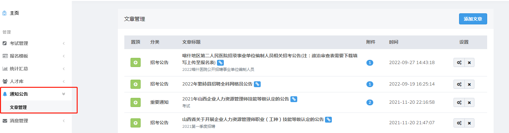
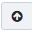
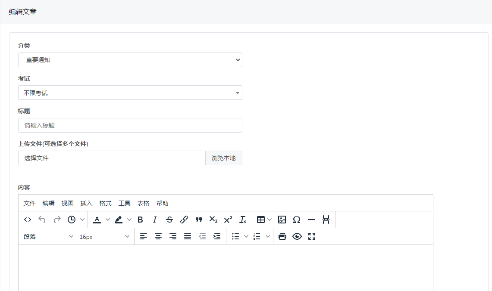
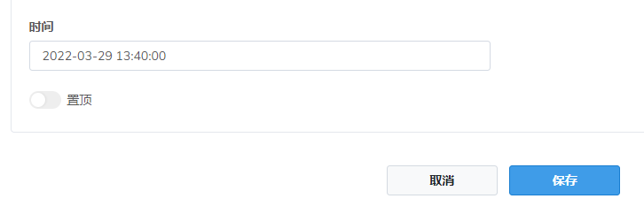

# 通知公告

用户可在系统中发布招考公告、报考答疑等文章，考生可及时在前台报名系统中查看

点击可使该篇文章置顶显示

## 添加文章

点击可进入添加文章页面

文章分类选项默认为三种，**重要通知，招考公告，报考答疑**

上传文件后，会出现上传文件的具体路径，上传的文件会直接出现在报名端文章末尾

## 修改文章

点击可进入文章修改文章页面

**发布时间**

支持设置自定义时间，未到发布时间报名端不予显示